# GenAI RAG Platform

[](https://www.terraform.io)
[](https://cloud.google.com)
[](https://www.python.org)
[](LICENSE)
[](.github/workflows/ci.yml)

A production-grade, multi-region **Hybrid Semantic-Cache and Routed Multi-Agent RAG** platform deployed entirely on **Google Cloud** with **Terraform** as the source of truth. Built as a reference implementation for the *Hack2Skill Challenge 2: Designing a Gen AI System for Accuracy and Speed at Scale*.

---

## Why this exists

Vanilla RAG breaks under two pressures: tail latency that balloons past 8 seconds during traffic spikes, and hallucinations that surface when retrieval returns semantically close but factually wrong chunks. Both failure modes trace back to the same root cause — treating every incoming query as if it needs the full retrieve-augment-generate pipeline.

This platform fixes that by introducing **two decision layers upstream of the LLM**:

1. A **semantic caching layer** at the edge that intercepts queries crossing a similarity threshold against historic Q/A pairs, returning cached responses in **under 10 ms** without ever touching the LLM.
2. A **dynamic intent router** that classifies traffic into buckets — simple factual lookups, multi-hop reasoning, agentic tool-use, clarification flows — and dispatches each bucket down a different execution path with a different model and retrieval depth.

The pragmatic inversion: the LLM call is the most expensive resource in the system, so you only invoke it when cheaper layers cannot satisfy the request.

---

## Architecture

```mermaid
flowchart LR
    %% ===== 1. Request enters =====
    A([User sends a question]) --> B["Step 1 — Front Door<br/>Cloud Load Balancing<br/>+ Cloud Armor WAF<br/>(Rate limit, Auth, TLS)"]

    %% ===== 2. Check the cache first =====
    B --> C{{"Step 2 — Check Cache<br/>Memorystore for Redis<br/>Has anyone asked this before?<br/>(cosine similarity ≥ 0.92)"}}
    C -->|Yes, similar Q found| Z(["Return cached answer<br/>in under 10 ms"])

    %% ===== 3. Classify the question =====
    C -->|No match — keep going| D["Step 3 — Classify Question<br/>Vertex AI · Gemini 2.5 Flash<br/>(runs on Cloud Run)"]
    D -->|Simple fact| E1[Lightweight path]
    D -->|Multi-step reasoning| E2[Full RAG path]
    D -->|Needs a tool| E3[Agentic path]

    %% ===== 4. Hybrid retrieval =====
    E1 & E2 & E3 --> F["Step 4 — Find Relevant Docs<br/>Search orchestrator on GKE Autopilot"]
    F --> F1["Semantic search<br/>AlloyDB + pgvector<br/>(HNSW index, tenant filter)"]
    F --> F2["Keyword search<br/>AlloyDB Postgres FTS<br/>(BM25 / tsvector)"]
    F1 --> G["Step 5 — Merge Results<br/>Reciprocal Rank Fusion<br/>(combines both lists)"]
    F2 --> G

    %% ===== 5. Rerank + expand context =====
    G --> H["Step 6 — Rerank<br/>Vertex AI Endpoint<br/>Cohere Rerank 3 (or BGE)<br/>Top 50 → Top 5"]
    H --> I["Step 7 — Expand Context<br/>AlloyDB pulls parent chunks<br/>128 tokens → 512 tokens"]

    %% ===== 6. Pick the right LLM =====
    I --> J{Step 8 — Pick the right model}
    J -->|Fast, cheap answer| K1["Vertex AI<br/>Gemini 2.5 Flash"]
    J -->|Hard reasoning| K2["Vertex AI Model Garden<br/>Claude 3.5 Sonnet or GPT-4o"]
    K1 --> L["Step 9 — Stream the answer<br/>GKE service streams tokens (SSE)<br/>User sees first word under 200 ms"]
    K2 --> L
    L --> Z

    %% ===== 7. Save it for next time =====
    L --> M["Step 10 — Save for next time<br/>Cloud Tasks fires async write"]
    M --> N["Memorystore + AlloyDB<br/>Cache the answer · Update session memory"]

    %% ===== Observability (watches the whole pipeline) =====
    O["Always watching<br/>Cloud Trace · Managed Prometheus<br/>Cloud Logging · Arize Phoenix<br/>(Latency, accuracy, drift)"]
    O -.watches.-> B
    O -.watches.-> D
    O -.watches.-> H
    O -.watches.-> J

    %% ===== Styling =====
    classDef gcp fill:#E8F0FE,stroke:#4285F4,stroke-width:1.5px,color:#202124;
    classDef cache fill:#FCE8E6,stroke:#D93025,stroke-width:1.5px,color:#202124;
    classDef llm fill:#E6F4EA,stroke:#137333,stroke-width:1.5px,color:#202124;
    classDef obs fill:#FEF7E0,stroke:#F9AB00,stroke-width:1.5px,color:#202124;
    classDef edge fill:#F1F3F4,stroke:#5F6368,stroke-width:1.5px,color:#202124;

    class B,F,L,M,Z edge;
    class C,N cache;
    class D,H,K1,K2 llm;
    class F1,F2,I gcp;
    class O obs;
```



See [`docs/architecture.md`](docs/architecture.md) for a full component walk-through.

---

## Component mapping to Google Cloud

| Logical Component | Google Cloud Service | Terraform Module |
|---|---|---|
| API Gateway | Cloud Load Balancing + Cloud Armor + API Gateway | `terraform/modules/api-gateway` |
| Semantic Cache | Memorystore for Redis (with RediSearch) | `terraform/modules/memorystore-redis` |
| Intent Router LLM | Vertex AI — Gemini 2.5 Flash | `terraform/modules/vertex-ai` |
| Dense Vector Search | AlloyDB for PostgreSQL with `pgvector` | `terraform/modules/alloydb` |
| Sparse BM25 Search | AlloyDB FTS + tsvector | `terraform/modules/alloydb` |
| Re-ranker | Vertex AI Endpoint (Cohere Rerank 3 / BGE) | `terraform/modules/vertex-ai` |
| Application Workloads | GKE Autopilot + Cloud Run | `terraform/modules/gke`, `terraform/modules/cloud-run` |
| Session Memory | AlloyDB + Memorystore Redis | `terraform/modules/alloydb` |
| Observability | Cloud Trace + Cloud Logging + Managed Prometheus | `terraform/modules/monitoring` |
| Secrets | Secret Manager | `terraform/modules/secrets` |
| Network | VPC + Private Service Connect + Cloud NAT | `terraform/modules/network` |
| IAM | Workload Identity Federation | `terraform/modules/iam` |

---

## Repo layout

```
genai-rag-platform/
├── README.md                       # You are here
├── ARCHITECTURE.md                 # Deep design rationale
├── Makefile                        # Common dev targets
├── docs/                           # Architecture, deployment, runbook
├── terraform/
│   ├── main.tf                     # Root composition of modules
│   ├── variables.tf
│   ├── outputs.tf
│   ├── providers.tf
│   ├── backend.tf                  # Remote state in GCS
│   ├── environments/{dev,staging,prod}/
│   └── modules/                    # Reusable, composable modules
├── src/                            # Application code (Python)
│   ├── api/                        # FastAPI service
│   ├── cache/                      # Semantic cache client
│   ├── router/                     # Intent classification
│   ├── retrieval/                  # Hybrid dense + sparse search
│   ├── reranker/                   # Cross-encoder reranker client
│   ├── orchestration/              # LangGraph workflows
│   ├── memory/                     # Session memory store
│   └── observability/              # OpenTelemetry tracing
├── docker/                         # Container images
├── k8s/                            # Kubernetes manifests (Kustomize)
├── .github/workflows/              # CI/CD pipelines
├── tests/                          # Unit, integration, Ragas eval
└── scripts/                        # Bootstrap, deploy, teardown
```

---

## Quick start

### Prerequisites

- Google Cloud project with billing enabled
- `gcloud` CLI authenticated (`gcloud auth application-default login`)
- Terraform `>= 1.7`
- Python `>= 3.11`
- Docker

### Bootstrap a dev environment

```bash
# 1. Set your project context
export PROJECT_ID="your-gcp-project-id"
export REGION="us-central1"

# 2. Run one-time bootstrap (creates GCS state bucket, enables APIs)
./scripts/bootstrap.sh

# 3. Deploy infrastructure
cd terraform/environments/dev
terraform init
terraform plan -out=tfplan
terraform apply tfplan

# 4. Build and push the API image
make docker-build
make docker-push

# 5. Deploy the application to GKE
make k8s-deploy ENV=dev
```

Full instructions in [`docs/deployment.md`](docs/deployment.md).

---

## What's deployed

A `terraform apply` against the `dev` environment provisions:

- A VPC with three subnets (apps, data, gke-pods) and Cloud NAT for egress
- A regional GKE Autopilot cluster with Workload Identity enabled
- A Memorystore for Redis instance (HA tier, 5 GB) for semantic caching
- An AlloyDB cluster (1 primary + 1 read replica) with `pgvector` enabled
- A Vertex AI endpoint with the re-ranker model deployed behind it
- Cloud Run service for the lightweight intent router
- An external HTTPS Load Balancer with Cloud Armor WAF
- Managed Prometheus + Cloud Trace exporters for full observability
- Service accounts with least-privilege IAM bindings via Workload Identity

---

## Design choices

### Why Terraform over Deployment Manager / gcloud scripts
Terraform's state model, plan/apply diffing, and module ecosystem make multi-environment promotion (dev → staging → prod) straightforward. Deployment Manager has effectively been deprecated in practice, and shell scripts don't survive contact with drift.

### Why AlloyDB over Cloud SQL for the vector store
AlloyDB delivers up to 4x the read throughput of Cloud SQL Postgres on the same hardware, has native columnar acceleration, and supports `pgvector` with HNSW indexing. For a RAG workload that's read-heavy on vector similarity, AlloyDB is the right primitive.

### Why Memorystore Redis over Valkey self-hosted
Managed Redis with RediSearch eliminates the operational overhead of running a vector cache. For a reference architecture targeting production reliability, the managed path wins.

### Why GKE Autopilot over Cloud Run for the main API
Cloud Run is excellent for stateless request/response, but the orchestration layer holds in-process session state and benefits from sidecar tracing and finer pod-level networking control. GKE Autopilot gives that without the burden of node management.

### Why a multi-model LLM strategy
Anchoring on GPT-4o everywhere puts p95 latency above 4 seconds and collapses unit economics. Anchoring on Gemini Flash everywhere caps accuracy below what regulated workloads require. Dynamic routing — Gemini 2.5 Flash for 80% of traffic, Claude 3.5 Sonnet / GPT-4o for the 20% that needs frontier reasoning — wins on both axes.

See [`ARCHITECTURE.md`](ARCHITECTURE.md) for the full rationale.

---

## Operational characteristics

| Metric | Target | Mechanism |
|---|---|---|
| Cache hit TTFT | < 10 ms | Memorystore Redis with vector similarity |
| Cache-miss TTFT | < 200 ms | Token streaming via SSE |
| End-to-end p95 latency | < 1.5 s | Async pipeline + connection pooling |
| Retrieval recall@10 | > 0.92 | Hybrid search + RRF + reranker |
| Faithfulness (Ragas) | > 0.90 | Two-stage reranking + parent-chunk expansion |
| Availability | 99.9% | Multi-zone GKE + HA Redis + AlloyDB replica |

---

## Contributing

PRs welcome. Run `make lint test` before opening one.

## License

MIT — see [`LICENSE`](LICENSE).

---

*This repository accompanies the Hack2Skill Challenge 2 submission. The companion LinkedIn write-up is linked in the submission form.*
